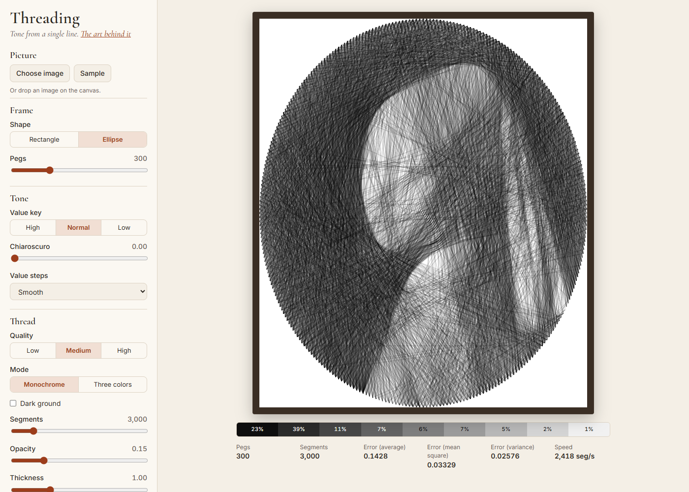

# Threading: string art from any picture

Turn a picture into string art. Pegs sit around a frame, and a single thread (or three
colored threads) runs in straight lines from peg to peg. Thousands of stacked lines
rebuild the picture, the way hatching builds tone in an engraving.

Everything runs in your browser. Nothing is uploaded.



## Features

- **Frame**: rectangle or ellipse, 40 to 1000 pegs.
- **Tone**: value key (high, normal, low), chiaroscuro (S-curve contrast), value steps
  (posterize into a 3 to 9 step value study).
- **Thread**: quality (working size 256, 512 or 1024 px), monochrome or three colors,
  light or dark ground, segments count, opacity, thickness.
- **Display**: thread drawing, value study or source view, pegs, live thread position
  indicators, squint (blur).
- **Output**: SVG download and a plain text winding guide (peg sequence per thread) for
  making the piece by hand.
- **Live stats**: segments, error (average, mean square, variance), speed.
- **Art notes**: hover any control to read the drawing idea behind it.

## Art and shading theory

String art is hatching with one rule: every stroke must run from one peg to another.
The tool leans on classic drawing ideas, and the page
[The art behind the threads](about.html) explains each one with diagrams:

- **Value and the value scale** (Denman Ross, Munsell): tone matters more than hue.
- **Hatching and cross-hatching** (Dürer): tone from line density.
- **Glazing**: stacked translucent layers multiply light.
- **Chiaroscuro and value key** (Leonardo, Caravaggio, Vermeer).
- **Optical mixing** (Chevreul, Seurat, halftone printing): subtractive CMY threads on
  white, additive RGB threads on black.
- **Squinting** to judge value masses.
- **Lineage**: Mary Everest Boole's curve stitching and Petros Vrellis's thread portraits.

## How it works

1. The picture is resized to the working size and toned (key, contrast, value steps).
2. The solver tracks the brightness the drawing shows at every pixel. On a light ground a
   pass of thread keeps `1 - opacity` of the light (stacked passes multiply, like glazes);
   on a dark ground a pass adds `opacity` of light, up to white. This is exactly how the
   canvas composites the lines (`multiply` and `lighter`), so what you see is what the
   solver optimized.
3. Each pixel also keeps its "gain": how much its squared error would drop if one more
   pass landed on it (negative if it is already dark enough). Each thread sits on a peg;
   the solver sums the gain along the line to every reachable peg, takes the best line,
   draws it, updates the pixels on it, and moves on. Neighbouring pegs and going straight
   back are not allowed. It stops when no line would help.
4. In three color mode each thread owns one channel. Channels do not affect each other,
   so each thread's best move is cached and only the thread that just moved is
   recomputed. Three colors cost the same per segment as one.

### Why it is fast

- The solver runs in a **Web Worker** and streams segments to the page in small batches,
  so the page stays smooth while the drawing grows.
- **Typed arrays only** and no allocations in the hot loop.
- Lines are traced with an **integer fixed point DDA**. When memory allows (about 96 MB),
  every peg-to-peg line is traced once into one flat table, and each step is then a plain
  sum over array runs.
- The canvas only draws **new** segments each frame. Changing display settings repaints
  without solving again, and lowering the segments count shows a prefix of the same path.

Benchmark on a laptop (`npm run bench`, 300 pegs, synthetic portrait):

| Quality | Working size | Mono | Three colors |
| --- | --- | --- | --- |
| Low | 256 px | ~11,000 segments/s | ~12,000 segments/s |
| Medium | 512 px | ~6,000 segments/s | ~5,000 segments/s |
| High | 1024 px | ~1,800 segments/s | ~1,600 segments/s |

A typical 3,000 segment piece at Medium quality is done in about half a second.

## Development

Requires Node 22 or newer.

```sh
npm install
npm run dev        # local dev server
npm test           # unit tests (vitest)
npm run bench      # solver benchmark in Node
npm run build      # production build in dist/
```

Code layout:

```
src/core/      solver, line tracing, pegs, tone, targets, stats (no DOM, testable)
src/worker/    Web Worker that runs the solver
src/render/    canvas drawing and the value study view
src/export/    SVG and winding guide
src/ui/        controls and styles
about.html     "The art behind the threads"
```

## Deploying to GitHub Pages

The workflow in `.github/workflows/pages.yml` tests, builds and deploys on every push
to `main`. In the repository settings, set **Pages > Source** to **GitHub Actions**.

## Credits

- Idea from [piellardj/image-stylization-threading](https://github.com/piellardj/image-stylization-threading).
  This is an independent implementation with new code.
- The technique was made famous by the artist Petros Vrellis.
- Sample picture: Johannes Vermeer, *Girl with a Pearl Earring*, about 1665, Mauritshuis,
  The Hague. Public domain, via
  [Wikimedia Commons](https://commons.wikimedia.org/wiki/File:1665_Girl_with_a_Pearl_Earring.jpg).

## License

[MIT](LICENSE)
